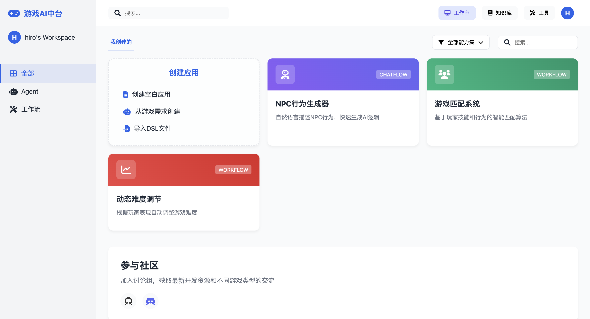
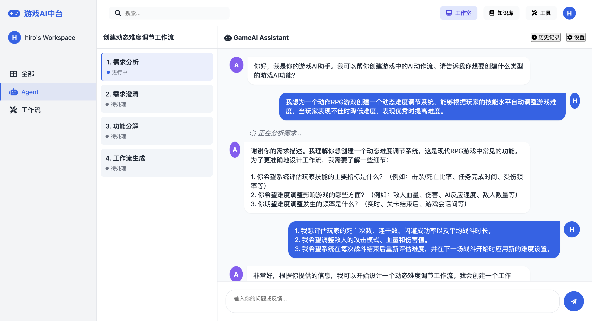
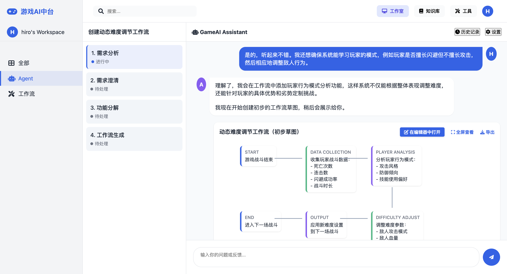
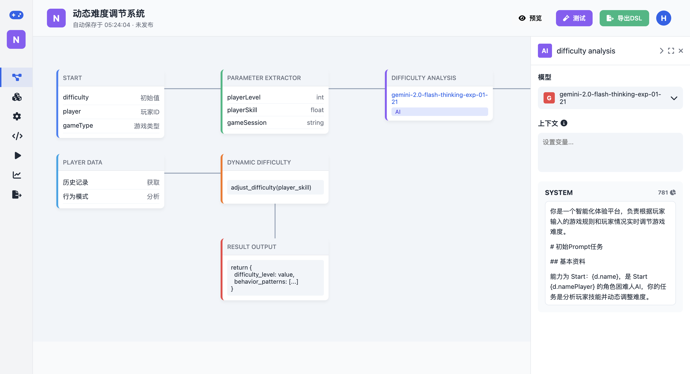
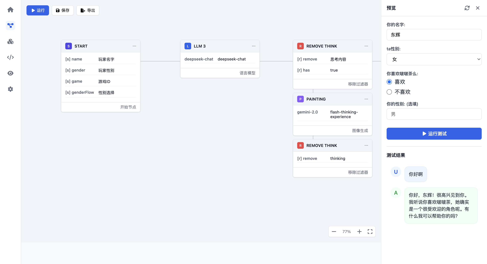

# Game Aop 产品需求文档

## 文档信息

| 文档信息 | 内容 |
|---------|------|
| 文档版本 | v1.0.0 |
| 创建日期 | 2025-04-02 |

## 产品概述

### 产品背景

随着游戏行业的快速发展，AI 在游戏中的应用日益广泛，包括 NPC 行为决策、游戏内容生成、玩家体验优化等。然而，当前游戏 AI 开发面临以下挑战：

1. **开发门槛高**：需要 AI 专业知识和编程技能
2. **开发周期长**：从设计到实现需要多轮迭代
3. **缺乏标准化工具**：不同游戏项目 AI 解决方案难以复用
4. **服务部署复杂**：从实验到生产环境部署流程繁琐
5. **需求变化快**：游戏需求变化频繁，需要快速响应
6. **试错成本高**：尝试不同的方案需要付出极高的成本
7. **老 AOP SDK 问题**：作为游戏 AI 组件，**“强买强卖”**了太多不合适的设计；作为 Agent 框架，与目前的主流设计则又渐行渐远。

针对这些问题，提出建设基于 Dify 的Game Aop 游戏 AI 中台，通过自然语言交互和自动化工作流降低游戏 AI 开发的技术门槛和时间成本。

### 产品愿景

打造一站式游戏 AI 开发平台，让游戏开发者能够通过自然语言描述需求，快速实现 AI 系统设计的全流程自动化，助力游戏开发团队提升 AI 体验质量和开发效率。

### 产品定位

工业级游戏 AI 中台，面向专业游戏开发团队，提供从 AI 需求收集、模型选择、逻辑编排到代码生成以及自动化部署（终期目标）的全流程解决方案。

### 目标用户

1. **游戏策划人员**：负责游戏玩法和 AI 行为设计，通常不具备编程能力，有前期快速原型验证的需求
2. **游戏程序员**：负责实现和集成 AI 功能
3. **游戏技术主管**：负责技术选型和架构决策
4. **游戏测试人员**：验证 AI 行为是否符合预期

### 整体界面风格

游戏 AI 中台的界面设计基于 Dify 的界面风格，但针对游戏 AI 特定需求进行了优化和扩展，主要特点包括：

- 简洁现代的设计风格，专注于游戏 AI 开发核心功能
- 游戏领域专业化的节点类型和工作流设计
- 可视化工作流编辑和预览功能
- 支持自然语言交互的 Agent 界面

下图展示了平台的主界面，包含了游戏 AI 专用的应用卡片和创建选项：



- **导航菜单**：简化的导航栏，包含全部、Agent、工作流等分类
- **应用卡片**：展示不同类型的已创建游戏 AI 应用，如 NPC 行为生成器、游戏匹配系统、动态难度调节等
- **创建选项**：支持创建空白应用、从游戏需求创建和导入 DSL 文件（yml格式）

## 产品功能需求

### 自然语言需求处理

处理阶段：
1. 需求描述与理解（粗略理解意图，类似于输入改写）
2. 需求澄清与精确化（导入策划文档 明确具体规则）
3. 需求拆分为粗工作流（只有节点信息，不包含节点参数细节）
4. 补充各节点参数细节以及数据转换（完整的工作流）

#### 需求描述与理解
- 支持用户通过自然语言描述游戏 AI 需求
- 支持导入文档作为游戏背景知识
- 系统应能理解游戏领域专业术语和上下文

#### 需求澄清与精确化
- 系统应主动识别需求中的模糊点并提出澄清问题
- 提供可视化交互方式帮助用户明确需求

##### 策划文档处理
- **策划文档规则（游戏逻辑）导入**
  - 支持Excel格式策划文档上传和解析
  - 实现规则优先级系统，将规则分为"核心规则"和"上下文规则"
  - 核心规则直接包含在prompt中确保100%遵守
  - 上下文规则存入RAG系统供按需查询

- **规则提取与分类**
  - 自动从策划文档中提取关键游戏规则
  - 根据重要性和使用频率对规则进行优先级分类
  - 为每条规则添加源文档引用信息，支持溯源和验证

- **资源提取与复用系统**
  - 自动识别策划文档中的特殊资源（如NPC prompt、对话模板、行为规则等）
  - 将这些资源从核心规则中分离出来，存入专门资源库
  - 为资源添加元数据（来源、用途、关联规则等）
  - 每个资源分配唯一ID，在工作流生成时使用引用机制
  - 支持资源版本控制和更新，不影响工作流结构
  - 工作流预览和运行时动态解析引用，加载相应资源

- **资源引用机制**
  - 在工作流生成时，插入对资源的引用而非资源本身
  - 使用特定语法表示资源引用，如：`{{RESOURCE:npc_prompts:guard_behavior}}`
  - 多个工作流节点可以引用同一资源，确保一致性
  - 支持资源的版本化管理，便于追踪变更并回滚

- **规则一致性验证**
  - 提供验证机制，确保生成的工作流完全符合策划文档规则
  - 自动检测工作流中可能违反规则的部分并标记
  - 支持规则冲突检测和解决建议

- **规则追踪**
  - 在工作流生成的每个步骤中，记录应用了哪些规则
  - 提供规则覆盖率报告，确保所有必要规则都被纳入考虑
  - 支持规则变更影响分析，评估规则变更对现有工作流的影响

- **RAG 游戏知识库移植**
  - 实现游戏专用RAG系统，提供游戏领域知识支持
  - 与策划文档规则系统协同工作，区分"必须遵守的规则"和"参考知识"

#### Agent交互界面

系统提供专门的 Agent 交互界面，支持用户通过自然语言与系统进行对话式交互：




- **对话区域**：展示用户与 Agent 的交互历史，通过对话完成需求描述与理解
- **工作流步骤**：左侧边栏显示工作流创建的各个步骤，帮助用户了解需求处理进度
- **工作流预览**：在对话中直接展示根据用户需求生成的工作流草图
- **编辑按钮**：支持一键跳转到工作流编辑器进行细节调整

#### 游戏类型适配
- 支持不同游戏类型的术语和模式识别：
  - MOBA类游戏（英雄行为、技能系统）
  - FPS类游戏（敌人AI、战术决策）
  - RPG类游戏（NPC行为、对话系统）

### 需求分解与工作流生成

#### 智能需求分解
- 系统应自动将复杂需求分解为功能节点
- 系统应自动识别功能节点间的依赖关系
- 支持可视化手动调整功能节点

#### 工作流生成
- 系统应基于分解的需求自动生成工作流图
- 生成的工作流应包含节点间的逻辑关系
- 支持节点参数自动配置
- 提供工作流在线预览和运行功能

#### 工作流编辑 
- 支持手动调整生成的工作流
- 提供拖拽式节点编辑界面
- 支持节点参数配置

#### 工作流编辑器界面

系统提供专业的工作流编辑器，是产品的核心界面，用于设计和配置游戏 AI 工作流：



- **工具栏**：提供工作流编辑、节点库、变量配置、代码查看、运行测试等功能
- **工作流画布**：可视化展示工作流节点和连接关系
- **属性面板**：用于配置节点参数、模型设置和 prompt

#### 版本管理
- 支持工作流的版本控制
- 提供回滚功能

### 模型集成与管理

#### 游戏 AI 专用模型
系统应预集成以下游戏专用 AI 模型：**游戏匹配**、**动态难度调节**、**tts**、**nlu**、**asr**、**llm**、**反外挂**

#### 模型管理（p2）
- 支持模型版本管理
- 提供模型性能指标监控
- 模型使用统计和分析

#### 模型市场
- 提供模型市场，支持第三方模型接入
- 支持自定义模型上传
- 提供模型评分和评价系统（p2）

### 预览与实验功能

#### 工作流模拟执行
- 支持在平台上模拟执行工作流
- 可视化展示执行过程
- 提供执行日志和状态查看



#### 数据类型与 Schema 处理

##### 类型系统设计
- 复用 Dify 的类型系统基础，确保与工作流引擎兼容
- 扩展游戏专用类型库，包括 Vector3D、NavMeshPosition 等游戏特有类型
- 为不同游戏类型(MOBA、FPS、RPG)提供预设类型库
- 采用两级哈希表结构，支持高效的类型存取和比较操作

##### 节点间数据转换
- Agent 智能生成类型转换节点，自动处理不同节点间的数据类型匹配
- 提供可视化数据映射配置界面，支持手动定义字段映射关系
- 内置常见游戏数据转换模板，如坐标系转换、状态映射等

##### 验证与监控
- 工作流执行前自动验证所有节点间的类型兼容性
- 类型错误智能修复建议，检测到类型错误自动要求 Agent 进行修复

##### 变量引用系统
- 采用 Dify 变量池（VariablePool）机制，实现中央化变量存储和检索
- 支持模板式的变量引用语法：`{{#节点ID.字段名#}}`
- 使用正则表达式支持复杂变量插值，如多层嵌套属性
- 支持跨节点引用的上下文管理，确保全局状态一致性

##### 配置示例
```yaml
# 代码节点类型转换示例
data:
  code: |
    def convert_player_data(player_data):
      # 将游戏特有的数据结构转换为 Agent 可以处理的格式
      return {
        "location": convert_vector3d(player_data["position"]),
        "playerLevel": player_data["level"],
        "gameState": player_data["state"],
      }
      
    def convert_vector3d(vector):
      # 将 3D 坐标转换为可读格式
      return f"X: {vector['x']}, Y: {vector['y']}, Z: {vector['z']}"
  code_language: python3
  outputs:
    result:
      type: object
  type: code
  variables:
  - value_selector:
    - gameEvent  # 源节点ID
    - player_data # 源节点字段
    variable: player_data

# 变量引用示例
data:
  prompt_template: 
    - role: "system"
      text: "你正在分析的玩家位置是 {{#gameData.position#}}"
  type: "llm"
```

#### 性能评估（p2）
- 提供 AI 模型性能指标评估

#### A/B测试（p2）
- 支持多版本 AI 行为对比

### 配置生成与 SDK 集成

#### 服务端配置生成
基于工作流自动生成服务端 YML 配置

系统采用 YML 配置文件替代原有的`IDL.py`手写方式，主要基于以下考虑：

- **Dify兼容性**：YML 格式与 Dify 工作流引擎天然兼容，便于在整个系统中统一配置格式
- **更高灵活性**：相比于固定的 IDL.py 代码生成，YML 配置可以更灵活地表达复杂的游戏 AI 逻辑和参数
- **升级便捷性**：未来只需更新 AOP-SDK 即可支持新特性，无需处理已生成的用户代码
- **解耦合设计**：YML 配置作为"key"，实现了配置与 AOP-SDK 彻底解耦的可插拔式架构。**`策划需求的变更，不会导致代码的变更。`**
- **动态实例化**：支持根据 YML 配置在运行时动态实例化所需组件，无需重新生成代码。

#### SDK 集成
- 对现有 AOP-SDK 进行重构，支持根据 yml 配置动态实例化
- 提供简洁的 API 接口
- 可根据需要手动二次修改 SDK（不同组件的抽象类提供前处理/后处理等接口）
- SDK 集成 Makefile 和部署脚本
- 一期试点后，平台将内嵌的工作流引擎切换到 AOP SDK，防止同时维护两套。

#### SDK 设计

##### 架构概述
AOP SDK 基于 Dify 工作流运行时内核重构，实现了更高效、更轻量的游戏 AI 执行引擎。其架构由以下核心组件构成：

- **WorkflowEngine**：工作流执行引擎，负责解析 YML 配置并创建运行时图
- **GraphRuntime**：节点图运行时，负责节点的初始化、执行和连接管理
- **VariablePool**：变量管理池，提供节点间数据传递和类型转换
- **NodeRegistry**：节点注册中心，支持核心节点与自定义第三方节点
- **StateManager**：状态管理器，实现持久化与会话管理

##### 核心功能

###### 高效工作流执行
- 采用 DAG 模型实现工作流节点编排
- 支持并行执行节点，提升运行效率
- 智能节点调度，基于依赖关系优化执行顺序

###### 状态管理与持久化
- 支持多级状态存储：内存、Ace 和数据库
- 复用 Ace 实现会话状态的自动恢复

###### 通信与集成
- 支持多种通信协议：Ace Rpc 和 REST API
- 内置事件系统，支持远程调试和监控 （p2）
- 实时日志流和指标监控 （p2）

###### 变量与上下文管理
- 变量池中央化管理，支持复杂数据结构
- 类型安全的数据流动，带有自动转换

##### 实现细节

###### YML 动态解析器
```python
class WorkflowYMLParser:
    def parse(self, yml_path: str) -> GraphConfiguration:
        # 读取并解析 YML 文件
        # 验证配置有效性
        # 转换为内部图配置格式
```

###### 核心运行时引擎
```python
class AopWorkflowEngine:
    def __init__(self, config_path: str):
        self.config = WorkflowYMLParser().parse(config_path)
        self.graph = GraphRuntime(self.config)
        self.state_manager = StateManager()
        self.variable_pool = VariablePool()
    
    def run(self, input_data: dict) -> dict:
        # 初始化运行上下文
        # 执行节点图
        # 返回结果
```

###### 节点注册机制
```python
@node_registry.register("custom_game_node")
class CustomGameNode(BaseNode):
    def run(self, context):
        # 自定义游戏节点实现
```

###### RPC 选项
```python
class AopRpcServer:
    def start(self):
        # 初始化 Ace
```

##### SDK 扩展系统

###### 游戏专用节点
- **游戏匹配节点**：实现智能玩家匹配算法
- **动态难度节点**：根据玩家行为自适应调整难度

###### 可插拔的扩展系统 （p2）
- 支持动态加载第三方节点包
- 提供标准化接口供外部系统集成
- 多语言 SDK 支持（Python、C++、C#）

#### 部署选项
- 支持 objserv 部署
- 提供容器化部署

#### 客户端调用
- 支持 ace 原生接口通信
- 提供 c#、c++ 以及 python 版本客户端

### 项目与团队管理（p2）

#### 项目管理
- 支持创建和管理多个游戏AI项目
- 提供项目报表和分析

#### 团队协作
- 支持多角色权限管理
- 提供团队协作工具
- 支持评论和讨论功能

#### 知识库（p2）
- 复用 dify 的 Rag 管线，提供完整的 Rag 功能

## 竞品和差异化分析

以下是本游戏 AI 中台与市场上主要竞品的功能对比分析:

| 功能/特性 | 游戏AI中台（本产品） | Dify | MetaGPT | 现有产品 |
|---------|-----------------|------|--------|--------|
| **核心定位** | 专注于游戏 AI 开发的解决方案 | 通用 AI 应用开发平台 | 多Agent协作开发框架 | 工程化低代码平台 |
| **需求处理** | 通用自然语言处理 | 通用自然语言处理 | 通用自然语言处理 | IDL 处理 |
| **工作流生成** | ✅ | ✅ | ❌ | ❌ |
| **游戏AI模型** | ✅ | ✅ | ❌ | ✅ |
| **代码/配置生成** | ✅ | ✅ | ✅ | ❌ |
| **SDK集成** | ✅ | ✅ | ❌ | ✅ |
| **代码部署** | ✅ | ❌ | ❌ | ✅ |
| **RAG能力** | ✅ | ✅ | ❌ | ❌ |
| **多Agent协作** | ✅（未来支持） | ❌ | ✅ | ❌ |
| **行业专注度** | 游戏AI领域 | 通用型AI | 通用型AI | 低代码框架 |
| **集成能力** | 游戏专用服务 | 通用API | 标准代码 | 开发框架 |

### 差异化优势

相比于通用AI平台（如Dify）和AI开发框架（如MetaGPT），本游戏AI中台的核心差异化优势在于：

1. **游戏领域专业化**：从底层架构到上层应用，完全围绕游戏AI需求设计，理解游戏特有术语和场景
2. **端到端游戏AI解决方案**：提供从需求收集、AI设计到代码生成和部署的完整流程，无需在多个工具间切换
3. **游戏专用AI模型**：内置游戏匹配、动态难度调节等游戏特有AI模型，无需额外开发
5. **复用优势**：基于Dify的强大工作流引擎，同时整合现有游戏SDK，提供更高效的开发体验

### 界面与产品需求的关联

平台的界面设计直接支持上述差异化优势：

1. **游戏领域专业化**：界面和节点类型专为游戏AI开发设计，如动态难度调节、玩家行为分析等专用节点
2. **工作流自动生成**：支持从自然语言需求生成工作流，并提供可视化编辑
3. **游戏专用AI模型**：界面集成难度调节、行为生成等游戏特有模型
4. **配置生成与SDK集成**：支持将工作流导出为DSL，用于游戏服务中的集成

## 产品路线图

### 第一阶段 

第一阶段将完成游戏AI中台的核心框架搭建和基础功能实现，重点交付如下：

| 功能模块 | 具体功能 | 说明 |
|---------|--------|--------|
| **需求理解与处理** | 自然语言理解 | 通过自然语言理解游戏AI需求 |
| | 术语识别与文档导入 | 支持游戏专业术语识别和详细文档导入 |
| | 需求澄清与精确化 | 主动识别需求模糊点并提出澄清问题 |
| | 游戏类型适配 | 支持MOBA、FPS、RPG等各类游戏类型 |
| | Agent交互界面 | 提供专门的Agent交互界面供用户对话 |
| **工作流生成和管理** | 智能需求分解 | 自动将复杂需求分解为功能节点 |
| | 自动工作流生成 | 基于分解的需求自动构建节点间逻辑关系 |
| | 可视化编辑器 | 提供拖拽式节点编辑界面与参数配置 |
| | 版本管理系统 | 支持工作流的版本控制与回滚功能 |
| **模型与执行** | 游戏专用AI模型 | 集成游戏匹配、动态难度调节、语音等模型 |
| | 模型市场 | 支持第三方模型接入和自定义模型上传 |
| | 工作流模拟执行 | 可视化展示执行过程和状态 |
| | 工作流测试界面 | 提供用于测试工作流的专用界面 |
| **配置与SDK** | YML配置文件生成 | 基于工作流自动生成服务端YML配置 |
| | 可插拔式架构 | 支持在运行时动态实例化组件 |
| | 专用AOP SDK集成 | 提供游戏专用SDK用于集成与调用 |
| | 配置与AOP SDK解耦 | 实现配置与SDK的完全解耦，提高升级灵活性 |


### 第二阶段

第二阶段将完成所有P2需求和众包服务节点功能，进一步增强平台能力和使用体验：

| 功能模块 | 具体功能 | 说明 |
|---------|--------|--------|
| **模型管理** | 模型版本管理 | 支持各类模型的版本控制与升级管理 |
| | 模型评分与评价 | 为模型市场的模型提供评分和用户评价功能 |
| **高级实验功能** | 性能评估 | 提供精细的AI模型性能指标评估功能 |
| | A/B测试 | 支持多版本AI行为对比和实验管理 |
| **项目与团队管理**| 多角色权限管理 | 支持项目经理、开发者、测试者等不同权限角色 |
| | 团队协作工具 | 提供评论、任务分配和讨论功能 |
| **知识库增强** | RAG管线集成 | 复用Dify的RAG管线，提供完整的检索增强生成功能 |
| | 游戏知识库构建 | 为不同游戏类型构建专用知识库 |
| **众包服务节点** | 众包数据标注 | 支持将游戏数据标注任务分发给众包工作者 |
| | 众包节点集成 | 在工作流中新增众包节点类型，与其他节点无缝集成 |
| **自动化部署** | 一键式部署 | 支持从平台直接部署到游戏服务，无需手动传递DSL |

### 第三阶段

第三阶段将开发更高级的多 Agent 功能和 MCP 工具集成，进一步提升平台的智能化程度和自主能力：

| 功能模块 | 具体功能 | 说明 |
|---------|--------|--------|
| **多 Agent 协作系统** | Agent 协作模式 | 支持多个 Agent 间的通信、协商和协作 |
| | 复杂任务解析 | 自动将复杂游戏任务分解为多个 Agent 的协作流程 |
| **MCP 工具配置与集成** | MCP 工具接口 | 提供标准化的 MCP 工具接口 |
| | Agent 工具箱 | 为 Agent 配置专用工具，增强解决问题能力 |
| **复杂工作流生成** | 多组员协作模型 | 支持模拟多人开发团队协作过程的多 Agent 系统 |
| | 复杂游戏逻辑建模 | 生成包含状态机、条件分支等的复杂游戏逻辑模型 |
| **进阶自主实验平台** | 自主测试执行 | Agent 自主执行测试场景并生成测试报告 |
| | 自动策略优化 | 基于测试结果自动调整 Agent 策略和行为 |
| | 虚拟游戏世界模拟 | 构建虚拟游戏环境，供多 Agent 交互和实验 |
| **自动化部署和测试** | 泳道自动化部署 | 支持将工作流自动部署到指定泳道，实现隔离测试 |
| | 多环境配置 | 支持开发、测试、预发布、生产等多环境配置 |


## 交付标准

### 验收标准


### 质量指标

